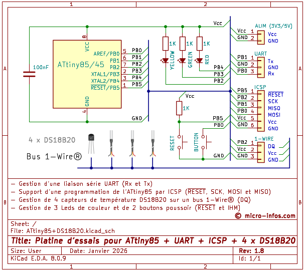
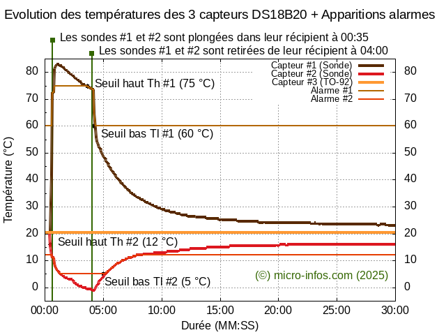

# ⭕ DS18B20

Projet basé sur une platine d'essais pouvant gérer jusqu'à 4 capteurs de température [DS18B20](https://www.analog.com/media/en/technical-documentation/data-sheets/ds18b20.pdf) avec un [ATtiny85](https://ww1.microchip.com/downloads/en/devicedoc/atmel-2586-avr-8-bit-microcontroller-attiny25-attiny45-attiny85_datasheet.pdf) alimenté en 5V et cadencé à 16 MHz.

La gestion est faite au dessus de  avec les fonctionnalités supplémentaires suivantes:
* La gestion du bus 1-Wire avec la "découverte" des capteurs qui peuvent être déconnectés/reconnectés du bus à chaud à concurence du nombre de capteurs à détecter et lu dans l'EEPROM
     * 📔 Le nombre de capteurs à gérer peut ainsi être "bridé" à 1, 2 ou 3 capteurs DS18B20
* Led jaune allumée fugitivement pour en plus indiquer l'activité sur le bus 1-Wire
* Commandes:
     * Ajout de la commande "<C" pour la configuration des seuils et de la résolution de chaque capteur détecté
     * Ajout de la commande "<T" pour l'activation/déactivation des traces (pas de traces par défaut)
     * Cf. § [Commandes/Réponses](Tests/Commands+Responses.txt) pour plus de détails
* Emission d'une trame complète préfixée par '$' au format hexadécimal ASCII, avec un CRC8-MAXIM terminal suivi d'un '\n' contenant:
     * Un *header* avec:
         * Le numéro de type de la platine lu de l'EEPROM
         * L'*Id* de la platine lu de l'EEPROM
         * Le numéro de la trame
         * Le *timestamp* de la trame
         * Le nombre de capteurs détectés
     * Les informations propres à chaque capteur:
         * Son *Id* dans la liste
         * Son numéro de famille dans le monde 1-Wire (ici 0x28)
         * La température Tc mesurée
         * La température Th du seuil haut
         * La température Tl du seuil bas
         * La résolution de la mesure
         * L'état de l'alarme (Tc ≤ Tl ou Tc ≥ Th)
         * Un CRC8-MAXIM pour garantir l'intégrité des informations de chaque cpateur et de l'ensemble de la trame émise        
     * Cf. le fichier [Commandes/Réponses](Tests/Commands+Responses.txt) pour l'interprétation de la trame

* Après agrégation, ci-après le résultat d'une expérience sur 30 minutes avec 3 capteurs qui consiste à:
     * Mesurer la température d'un 1st capteur (sonde #1) plongé dans un récipient d'eau qui a été portée à ébullition
     * Mesurer la température d'un 2nd capteur (sonde #2) plongé dans un récipient rempli de glaçons
     * Mesurer la température d'un 3rd capteur (boitier TO-92) laissé à la température ambiante
     * Pour chaque capteur, une indication de l'alarme est présentée en superposition sur le graphe suivant: 

## 🛄 Organisation du projet
DS18B20 est organisé au sein des fichiers suivants dont les sources sont fournis:
* **ATtiny85_uOS+DS18B20.asm** et **ATtiny85_uOS+DS18B20.h**
     * Programme principal exécuté par uOS et incluant tous les fichiers qui suivent
     * 📔 La chaine de production du '.hex' n'utilise pas d'éditeur de liens
* **ATtiny85_uOS+DS18B20_Timers.asm**
     * Gestion de l'acquisition toutes les secondes et de l'émission de la trame de mesure
* **ATtiny85_uOS+DS18B20_Commands.asm**
     * Gestion de la commande "<C" pour la configuration des seuils et de la résolution
     * Gestion de la commande "<T" pour l'activation/déactivation des traces 
* **ATtiny85_uOS+DS18B20_1_Wire.asm**
     * Gestion du protocole 1-Wire
* **ATtiny85_DS18B20_1_Wire_Commands.asm**
     * Gestion des commandes du monde 1-Wire:
          * Commandes ROM standards (Read Rom [0x33], Match Rom [0x55] et Search ROM [0xF0])
          * Commandes spécifiques au DS18B20
               * Convert T [0x44]
               * Read Scratchpad [0xBE]
               * Copy Scratchpad [0x48]
               * Write Scratchpad [0x4E]
               * Alarm Search [0xEC]

DS18B20 utilise les 32 premiers octets l'EEPROM de l'ATtiny85 dont la structure en langage C est la suivante:

`typedef struct {` 
`   char           version[7+1];        // Version de l'eeprom avec un '\0' terminal` 
`   unsigned char  platine_type;        // Type de la platine` 
`   unsigned char  platine_id;          // Id de la platine` 
`   unsigned char  bauds_index;         // Index de Bauds 0: 19200 bauds, 1: 9600 bauds, ..., 6: 300 bauds` 
`   unsigned char  padding[4];          // Padding...` 
`   unsigned char  nbr_ds18b20;         // Nombre de capteurs DS18B20 (1, 2, 3 ou 4)` 
`   unsigned char  primes[16];          // Liste de 16 nombres premiers (cadencement de l'emission de la trame)` 
`} ST_EEPROM_DS18B20;`

Le contenu peut-être programmé depuis un fichier au format Hex (Intel) au moyen de la commande d'écriture offert par uOS "`<E0+data0+data1+data2+...`" (cf. [eeprom_4xds18b20.hex](Products/eeprom_4xds18b20.hex))

## ⚓ Occupation mémoires
DS18B20 occupe environ 81% de la mémoire *flash* et 73% de la mémoire SRAM de l'**ATtiny85**
* 📔 Une version "minimaliste" est à l'étude pour être implémentée sur un **ATtiny45** utilisant la version minimaliste de uOS avec:
     * La gestion de 2 capteurs au lieu de 4
     * La suppression des commandes/réponses (seuils de température et résolution lus de l'EEPROM)
     * L'abandon des détections d'apparition des alarmes
     * *Á compléter*

## ❗ Évolutions apportées à uOS pour accueillir DS18B20
Les évolutions très limitées dans uOS qui suivent permettent d'accueillir l'initialisation de la SRAM de DS18B20, la prolongation de commandes non supportées par uOS et la définition d'un *timer* supplémentaire (uOS utilisant les premiers *timers* #0 à #5)

Ces évolutions sont conditionnées par la directive `USE_DS18B20`

- Ajout dans **ATtiny85-uOS_Commands.asm** (méthode **exec_command**) de l'appel aux traitements des 2 nouvelles commandes "<C" et "<T"

`#ifdef USE_DS18B20` 
`     rcall   exec_command_ds18b20` 
`#else` 
`     rcall   print_command_ko     ; Commande non reconnue` 
`#endif` 

- Déroutement dans **ATtiny85-uOS_Timers.asm** de l'exécution du *timer* #6 pour le cadencement des mesures de températures et l'émission de la trame

`; ---------` 
`; Timer #6 pour DS18B20` 
`; ---------` 
`exec_timer_6:` 
`#ifdef USE_DS18B20` 
`     rcall   exec_timer_ds18b20` 
`#endif` 
`     ret` 
`; ---------` 

## 🛠️ Environnement de développement
* [Assembler for the Atmel AVR microcontroller family](https://github.com/Ro5bert/avra) légèrement modifié pour:
    * Accueillir les sauts **rjmp** et appels **rcall** relatifs
    * Ajouter des messages de *warning* comme:
        * "*ATtiny85_uOS+DS18B20.asm(1326) : Warning : Improve: Replace absolute by a relative branch (-2048 <= k <= 2047)*"
        * "*ATtiny85_uOS.asm(80) : Warning : Improve: Skip equal to 0*"
    * *Á compléter*
* Script *shell* [goGenerateProject.sh](goGenerateProject.sh) fourni pour l'assemblage et la génération du fichier '.hex' au format [HEX Intel](https://fr.wikipedia.org/wiki/HEX_(Intel)) ainsi que les fichiers '.lst' et '.map'
* Gestion des sources sous [CVS](https://tuteurs.ens.fr/logiciels/cvs/) permettant de faire évoluer le programme "prudemment" avec notamment:
    * Un retour arrière facilité
    * La différence entre différents développements versionnés
    * La pose d'un marqueur symbolique sur une révision d'un ou plusieurs fichiers
    * La création d'une branche sur le projet
    * etc.
* Développements sous Linux (distribution Ubuntu 24.04.3 LTS)
* *Á compléter*

## ⏳ Évolutions envisagées
- Remplacement des DS18B20 par d'autres périphériques comme une horloge RTC, un capteur d'humidité, etc.
- Accueil de la gestion d'un bus I2C en parallèle du bus 1-Wire pour permettre le support d'autres périphériques non disponibles sur le bus 1-Wire afin de proposer une platine avec la cohabitation de divers circuits connectés sur le bus 1-Wire et I2C
- Utilisation d'un code correcteur d'erreurs en vue d'une transmission de la trame depuis plusieurs platines sur un bus radio afin de pallier les éventuelles collisions ou erreurs de transmission
- *Á compléter*

