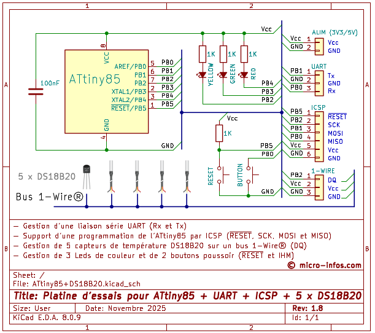

# ⭕ DS18B20

Projet basé sur une platine d'essais pouvant gérer 5 capteurs de température [DS18B20](https://www.analog.com/media/en/technical-documentation/data-sheets/ds18b20.pdf) avec un ATtiny85 alimenté en 5V et cadencé à 20 MHz.

La gestion est faite au dessus de  avec les évolutions suivantes:

* Led jaune allumée fugitivement pour la détection de l'appui bouton et l'activité sur le bus 1-Wire

* Commandes:
     * Ajout de la commande "<C" pour la configuration des seuils et de la résolution de chaque capteur détecté
     * Ajout de la commande "<T" pour l'activation/déactivation des traces
     * Cf. § [Commandes/Réponses](Tests/Commands+Responses.txt) pour plus de détails

* Emission d'une trame complète avec un CRC8-MAXIM contenant:
     * Un *header* avec:
         * Le numéro de type de la platine lu de l'EEPROM
         * L'*Id* de la platine lu de l'EEPROM
         * Le numéro de la trame
         * Le *timestamp* de la trame
         * Le nombre de capteurs détectée

     * Les informations propres à chaque capteur:
         * Son *Id* dans la liste
         * Son numéro de famille dans le monde 1-Wire (ici 0x28)
         * La température Tc mesurée
         * La température Th du seuil haut
         * La température Tl du seuil bas
         * La résolution de la mesure
         * L'état de l'alarme (Tc > Th ou Tc < Tl)
            
     * Cf. § [Commandes/Réponses](Tests/Commands+Responses.txt) pour plus de détails

* Script *shell* [goGenerateProject.sh](goGenerateProject.sh) fourni pour l'assemblage et la génération du fichier '.hex' au format [HEX Intel](https://fr.wikipedia.org/wiki/HEX_(Intel))

